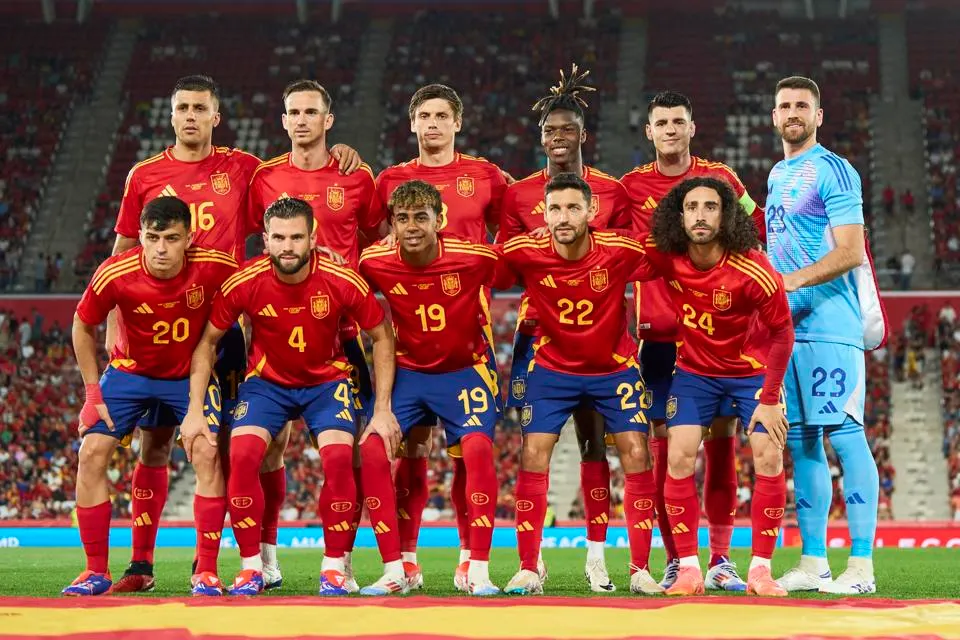

# Facial Recognition Project

## Project Overview
This project uses Python and machine learning libraries such as `facenet_pytorch` to identify a specific person's presence in a group photo. By comparing facial embeddings generated from individual and group photos, the script determines if the person of interest is in the group photo.

## 2 Examples

### Person of intrest

### Group Photo

### Output image

## Run finder.py with these libaries and tools
- `facenet_pytorch`: For detecting faces and generating facial embeddings.
- `torch`: PyTorch, for handling tensor operations.
- `PIL`: To handle image loading and processing.
- `cv2`: OpenCV for drawing and annotating images.

## Key Features
- **Person of Interest**: Path to the image of the individual to detect.
- **Group Photo**: Path to the group photo.
- **Output Photo**: Path where the annotated image will be saved.
- **Threshold**: Sensitivity of the face matching process. Set at 0.75.
- **Show Non-Matches**: Option to highlight faces not matching the person of interest in red.

## Workflow
1. **Load Images**: Load and convert images to appropriate formats.
2. **Detect and Embed Faces**: Use `MTCNN` to detect faces and `InceptionResnetV1` to compute their embeddings.
3. **Compare Faces**: Calculate the distance between the person of interest's embedding and each face in the group photo.
4. **Annotate Image**: Draw bounding boxes around detected faces, color-coded based on match status (green for match, red for no match).
5. **Output**: Save and output the annotated image indicating whether the person of interest was detected in the photo

